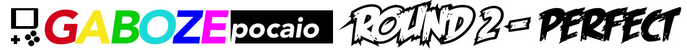
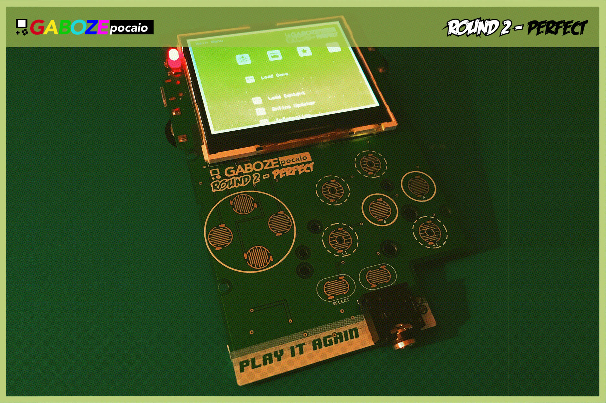
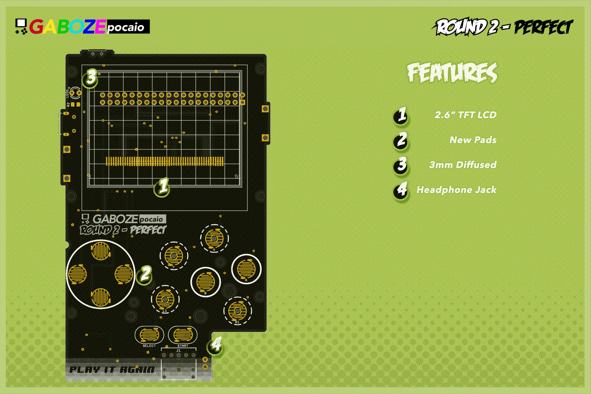
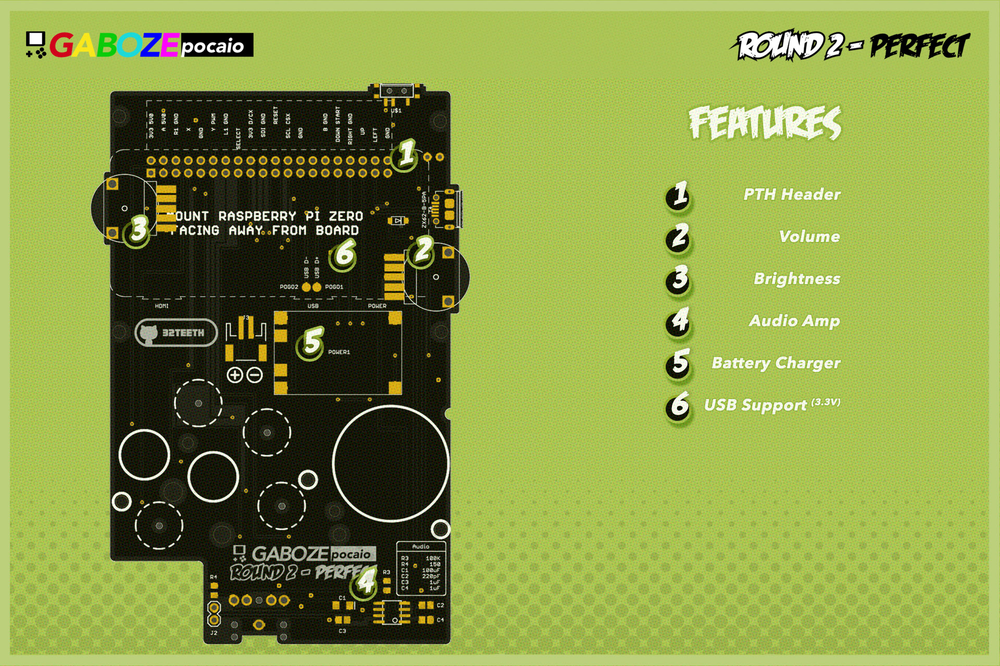
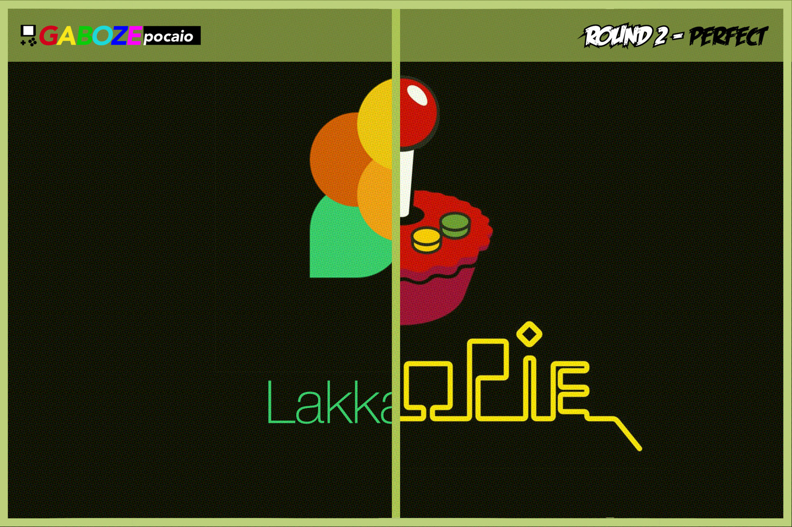

# 
> This is it!

Based on the popularity of the original [Gaboze Pocaio](https://github.com/GameboyZero/GabozePocaio) and it's many updates. We have taken the *Gaboze Pocaio - Plus Edition* which featured the 2.6" TFT *(ILI9342)* and added a few more features

Project Code Name: ***'Play It Again'***

## Introduction
> Do we need one?

### Features
> Things you can find on this kit

- 2.6" TFT LCD
- USB peripheral support for 3.3v accessories (ie: keyboards)
- Brightness Control Thumbwheel
- Volume Control Thumbwheel
- Power LED - 3mm diffused
- New Conductive Pads
- Through Hole Raspberry Pi Zero Mounting Header
- Battery Charger (TP4056 Module)
- Headphone Jack (LM4857)
- Speaker capability (LM4857)
- Audio Amp (LM4857)

| Top Side Features | Bottom Side Features |
| - | - |
|  |  |

### Platform Support:

- [x] [Emulation Station](http://www.emulationstation.org/)
- [x] [Lakka](http://www.lakka.tv/)
- [x] [RetroPie](https://retropie.org.uk/)

*For [Lakka](http://www.lakka.tv/) implementation you can follow the ['paint by numbers' tutorial](https://github.com/32teeth/Lakka-For-Gaboze-Pocaio)*

#### New Feature Discussion
> A little more behind the features

##### TFT
> A new screen

An adoption from the *Gaboze Pocaio - Plus Edition*. The screen is now a 2.6" TFT, which fills the screen area of the Game Boy Pocket shell much better. No more resizing of the video driver output!

##### Brightness Control
> Mechanical Adjustment FTW

Although there are many implementations of *software* based screen brightness adjustment. This model features a **thubwheel**, which means you don't need to worry about knowing how, or where to put the *software* based controls.

This also allows for using different *Operating Systems* and having brightness control out of the box

##### Through Hole Header
> No more loose connections

With the new Raspberry Pi Zero mounting system using a through hole header, you will no longer loosen the pin connection if using an unregulated (non temperature) control soldering iron...   ...yay

The short insulation on the header also means you can mount the Raspberry Pi flat against the headers

##### New Conductive Pads
> Better response. Simply put

With a redesigned conductive pad, you can now have a better response rate to your silicon aftermarket pads.

##### USB peripheral support
> No connection? No Problem

This is a 3.3V USB peripheral support, like keyboards (not the LED mechanical ones), older joysticks / gamepads *(can you say retro pads!)*

One of the most requested features is to be able to use your keyboard and terminal without having to connect to the network, SSH, SCP, or FTP.

##### Power LEd
> Domed and diffused

We replaced the surface mount power indicator LED with a through hole domed and diffused 3mm LED. This fits perfectly in the LED hole of the original and aftermarket *Game Boy Pocket* shell

## What you need
> Batteries not included

In order to complete your build. You will need:

- Raspberry Pi Zero W
- LiPo Battery
- Micro SD Card
- Gameboy Pocket Shell
