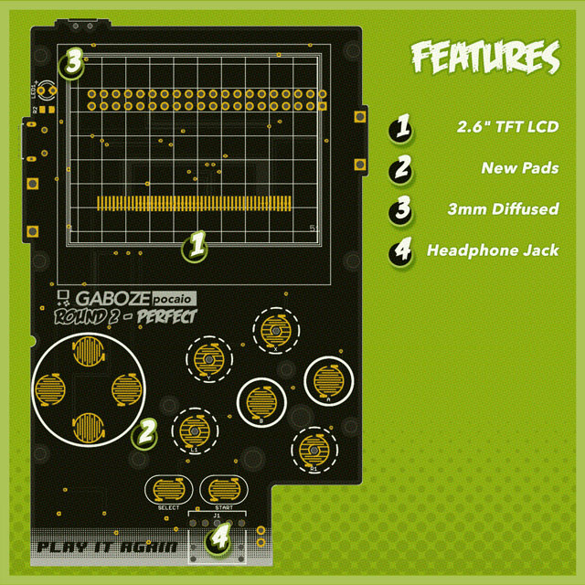
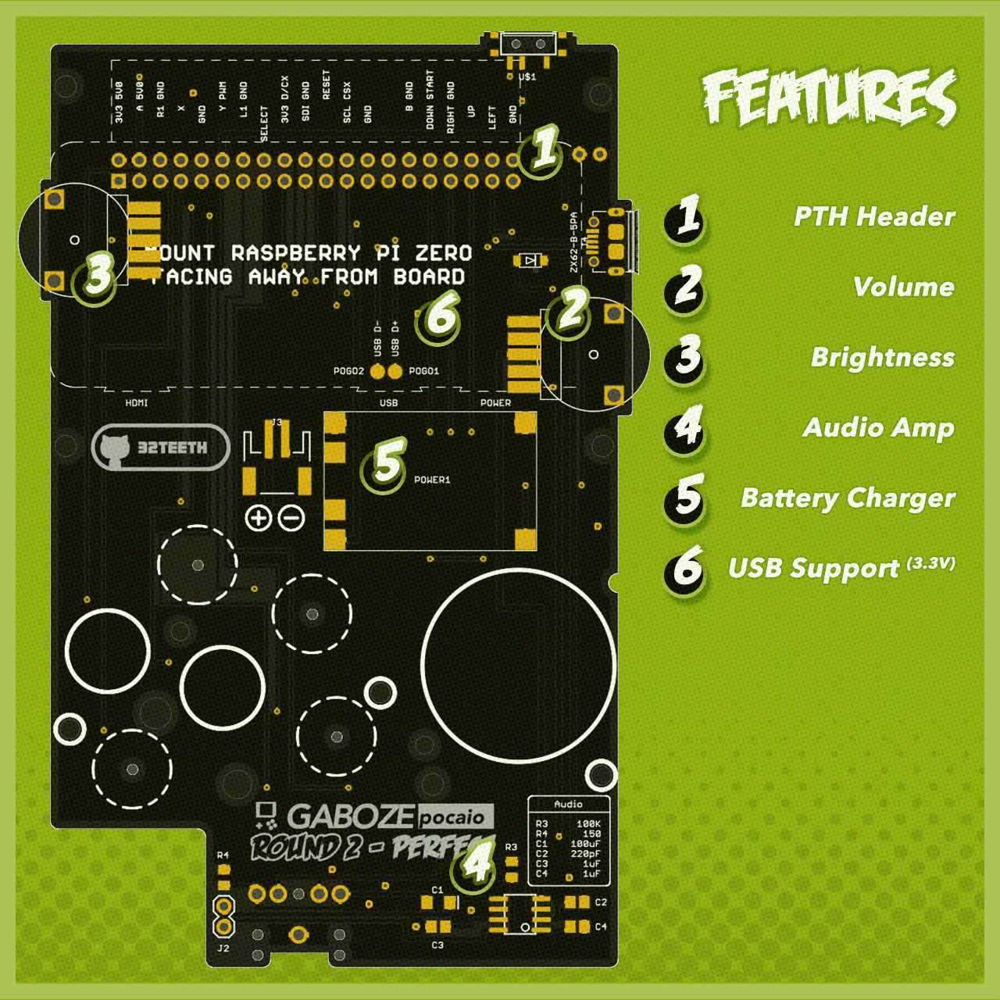

# 
> This is it!

Based on the popularity of the original [Gaboze Pocaio](https://github.com/GameboyZero/GabozePocaio) and it's many updates. We have taken the *Gaboze Pocaio - Plus Edition* which featured the 2.6" TFT *(ILI9342)* and added a few more features

Project Code Name: ***'Play It Again'***

## Introduction
> Do we need one?

### Features
> Things you can find on this kit

- 2.6" TFT LCD
- USB peripheral support for 3.3v accessories (ie: keyboards)
- Brightness Control Thumbwheel
- Volume Control Thumbwheel
- Power LED - 3mm diffused
- New Conductive Pads
- Through Hole Raspberry Pi Zero Mounting Header
- Battery Charger (TP4056 Module)
- Headphone Jack (LM4857)
- Speaker capability (LM4857)
- Audio Amp (LM4857)

| Top Side Features | Bottom Side Features |
| - | - |
|  |  |

### Platform Support:

- [x] [Emulation Station](http://www.emulationstation.org/)
- [x] [Lakka](http://www.lakka.tv/)
- [x] [RetroPie](https://retropie.org.uk/)

*For [Lakka](http://www.lakka.tv/) implementation you can follow the ['paint by numbers' tutorial](https://github.com/32teeth/Lakka-For-Gaboze-Pocaio)*

## Not included
> these things are easily found on the internet

* Raspberry Pi Zero W
* LiPo Battery
* Micro SD Card
* Gameboy Pocket Shell
